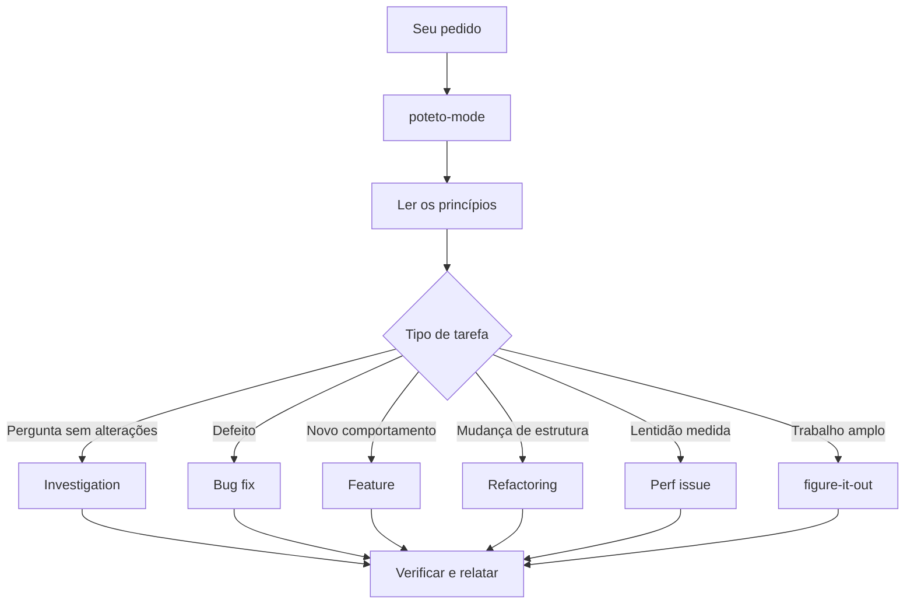

# Conduzir tarefas com poteto-mode

O `/poteto-mode` recebe a tarefa, escolhe um playbook, copia seus passos para a lista de trabalho e chama as skills necessárias. Um bom pedido descreve o objetivo e a forma de conferir a entrega.


## Acompanhe a escolha do fluxo



Essas são as rotas mais comuns. O [diretório de playbooks](../../skills/poteto-mode/playbooks/) também cobre protótipos, planos, diagnóstico de execução, paridade visual, PRs, autonomia, retomada e limpeza de worktrees.

## Diga o resultado esperado

```text
/poteto-mode usuários recebem duas notificações depois de uma nova tentativa. reproduza, corrija e verifique.
```

O pedido seleciona Bug fix. A ordem de reproduzir antes de corrigir é uma restrição concreta. Confira a lista de tarefas; passos ignorados devem trazer o motivo.

## Inclua o contexto que muda a tarefa

Um pedido útil pode conter cinco coisas:

- **Objetivo.** O defeito observado ou o comportamento desejado.
- **Critério de conclusão.** Algo que possa passar ou falhar.
- **Prova.** Saída de um comando, vídeo do fluxo, valor salvo ou comparação.
- **Contexto conhecido.** Uma reprodução, log, arquivo ou link.
- **Restrições.** Preservar comportamento, investigar antes de editar ou aguardar sua revisão.

```text
/poteto-mode o CSV perde a última linha desde o deploy de ontem. o job 4812 falhou. reproduza e corrija. está pronto quando a fixture de 60 mil linhas exportar todas. mostre as contagens antes e depois.
```

Deixe espaço para o agente escolher a implementação. Uma lista de skills pode reordenar passos que o playbook já coordena. Sua hipótese sobre a causa também pode estreitar a busca cedo demais.

Quando o relato estiver confuso, comece pela compreensão:

```text
/poteto-mode leia esta conversa e explique o problema com suas palavras. não altere código ainda.
```

Corrija a interpretação antes de existir uma implementação baseada nela.

## Use respostas curtas durante a mesma tarefa

Com o objetivo já estabelecido, `continue`, `pode fazer` ou `siga até concluir` podem ser suficientes. A conversa carrega o contexto. Se o agente perder o fluxo, peça que releia o playbook e retome do último passo comprovado.

Comece uma nova tarefa com `/poteto-mode` novamente. A [configuração](01-setup.md#execute-a-primeira-tarefa) explica como o modo entra em cada ambiente.

## Sinalize a mudança de assunto

```text
/poteto-mode nova tarefa. descubra por que o cache sobrevive ao logout. não altere código ainda.
```

“Nova tarefa” pede uma nova escolha de playbook. “Não altere código ainda” mantém a investigação separada da correção.

## Isole o trabalho paralelo

Cada agente que escreve precisa de sua própria branch e worktree. Instâncias do aplicativo também precisam de portas, dados e diretórios de saída separados quando compartilham a mesma máquina.

```text
/poteto-mode nova tarefa. crie um worktree a partir de <base> e faça a mudança do parser nele.
```

O port usa worktrees locais e as rotas nativas ou externas disponíveis em cada ambiente. Um worktree separa arquivos; não cria uma máquina independente nem separa automaticamente bancos e portas. A [referência de subagentes](../reference.md#subagents) explica o despacho.

Para recuperar espaço:

```text
/poteto-mode confira o que ocupa espaço e remova os worktrees que já podem ser descartados.
```

O [playbook de limpeza](../../skills/poteto-mode/playbooks/worktree-cleanup.md) confere branches mergeadas, alterações locais e sessões que ainda usam cada diretório antes de removê-lo.

## Deixe a tarefa continuar

```text
/poteto-mode vou me ausentar. continue até a migração não ter chamadas à API antiga. registre suas decisões.
```

Trabalho que você vai revisar depois passa por [figure-it-out](../../skills/figure-it-out/SKILL.md), que organiza fases e uma trilha de decisões. Defina também as permissões e o mecanismo de acompanhamento. O [capítulo de autonomia](07-overnight.md) mostra como.

Próximo: [Entender o código](03-understand.md).
