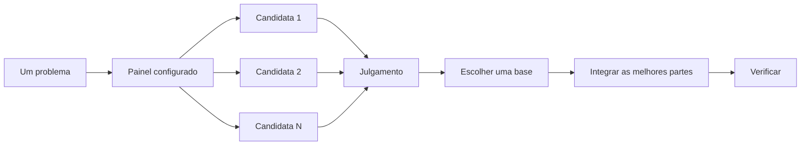

# Desenhar a mudança antes de implementar

Compare alternativas antes de investir na primeira forma que o agente propõe. Protótipos respondem às dúvidas executáveis, um README ou tutorial define a experiência de quem vai usar a API e o plano escrito organiza a entrega depois que o desenho estiver estabelecido.


## Defina tipos e limites com architect

```text
/architect desenhe o pipeline de importação. comece pela forma como os chamadores vão usá-lo.
```

O [architect](../../skills/architect/SKILL.md) investiga o código com how, consulta why quando muda camadas ou responsabilidades e usa arena para comparar desenhos. Cada proposta começa pelo uso, seguido dos tipos, assinaturas e módulos.

Por padrão, ele passa da síntese à implementação. Para revisar antes:

```text
/architect with checkpoint. mostre o desenho e espere minha revisão antes de implementar.
```

O desenho continua sujeito à evidência. Se a implementação exigir a mesma solução improvisada em lugares independentes, ou tipos que só compilam com `any` e coerções forçadas, architect manda reconsiderar a estrutura.

## Compare tentativas com arena

```text
/arena leve este pedido sem alterações aos participantes. quero comparar as propostas com a sua.
```

O [arena](../../skills/arena/SKILL.md) entrega o mesmo problema a várias tentativas, cada uma em seu worktree ou diretório. Um juiz compara as candidatas com uma rubrica, preferindo outra família de modelos quando a configuração permite. O coordenador lê os resultados, escolhe uma base, incorpora as melhores partes e verifica.



O painel vem do setup e pode ser ajustado por tarefa:

```text
/arena compare cinco alternativas. mudar este formato de chave depois será caro.
```

## Distribua cobertura com swarm

```text
/swarm confira cada pacote em packages/ com seu check.sh. um trabalhador por pacote e um relatório final.
```

O [swarm](../../skills/swarm/SKILL.md) distribui fatias independentes, matrizes de cobertura ou corridas com uma regra de seleção definida. Cada trabalhador recebe escopo e verificação; retorna `PASS`, `ISSUES` ou `BLOCKED`. O coordenador consolida resultados e lacunas.

Escolha arena para comparar soluções completas do mesmo problema. Escolha swarm para cobrir partes diferentes ou executar uma corrida com critério explícito.

## Revise o código com interrogate

```text
/interrogate revise a branch inteira. priorize bugs e regressões comprováveis. não altere nada ainda.
```

O [interrogate](../../skills/interrogate/SKILL.md) dá aos revisores o mesmo diff, intenção e rubrica. O painel segue as famílias configuradas. O coordenador classifica os achados como `Act on`, `Consider`, `Noted` ou `Dismissed`, explica as rejeições e não aplica correções automaticamente.

Leia também os achados descartados. A justificativa pode estar errada, e você pode contestá-la.

## Resolva dúvidas com protótipos

```text
/poteto-mode faça alguns protótipos para o novo menu. capture imagens ou vídeos para eu comparar.
```

O [playbook Prototype](../../skills/poteto-mode/playbooks/prototype.md) constrói alternativas descartáveis, permite alternar entre elas e registra imagens ou medições. Também serve para algoritmos, comportamento e dúvidas sobre uma API.

Para uma mudança maior:

```text
/poteto-mode precisamos limitar requisições de webhooks externos. use /architect e resolva as dúvidas com protótipos. deixe-me revisar antes de prosseguir.
```

Direcione a revisão adversarial ao diff produzido. Rodadas de interrogate sobre um plano sem código podem gerar riscos teóricos que um protótipo resolveria. Primeiro execute a alternativa; depois revise o que foi construído.

## Escreva o README primeiro para uma API

```text
/poteto-mode escreva primeiro um tutorial de uso do novo pacote de configuração. depois use /teach para explicar por que ele melhora a situação atual.
```

Descrever o uso obriga o desenho a partir do chamador. O tutorial também vira uma referência concreta para conferir a implementação. Use [technical-writing](../../skills/technical-writing/SKILL.md) quando precisar manter o texto no formato certo, como tutorial, explicação ou referência.

## Escreva o plano depois de estabelecer o desenho

```text
/poteto-mode transforme este desenho em um plano. PRs pequenos e verificáveis, cada um com suas próprias provas.
```

O [playbook Multi-phase plan](../../skills/poteto-mode/playbooks/multi-phase-plan.md) resolve dúvidas restantes por protótipos e escreve uma seção por PR. Cada seção liga mudanças a resultados observáveis e às verificações necessárias. Testes passando, sozinhos, não encerram a verificação.

O plano é a entrega dessa etapa. O agente executa o verificador do plano, informa seu resultado e para. O próprio plano nomeia o playbook de execução. A implementação começa quando você dá o go.

Numa migração, defina a equivalência que espera:

```text
/poteto-mode planeje a migração da biblioteca de UI. PRs pequenos com comparação visual. preserve o resultado original exatamente, inclusive os bugs.
```

Preservar os bugs evita misturar a migração com correções que impediriam a comparação. Quando o trabalho durar vários dias, o plano pode ficar no repositório para outros agentes acompanharem. Ao terminar, aplique a política do projeto para remover ou arquivar planos concluídos.

## Ajuste o esforço à decisão

- Uma mudança pequena já implementada pode precisar apenas de interrogate.
- Uma mudança de responsabilidades ou limites de funções pede architect.
- Uma decisão isolada entre formatos ou algoritmos pode usar arena.
- Uma matriz de verificações independentes pede swarm.
- Uma dúvida que um experimento resolve pede um protótipo.
- Uma decisão cara de reverter merece comparação de desenhos e revisão do código antes de entregar.
- Vários PRs merecem um plano depois que as decisões centrais estiverem demonstradas.

Próximo: [Implementar e limpar a mudança](05-build-and-clean.md).
