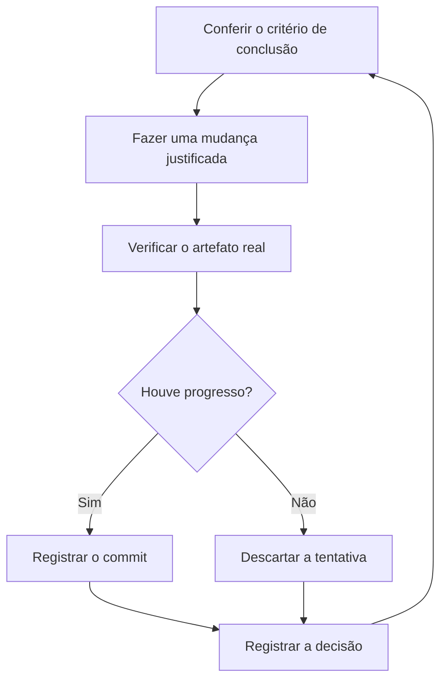

# Deixar trabalho em execução

Uma tarefa autônoma precisa de um critério de conclusão verificável, recursos isolados, permissões definidas e uma trilha para revisão. Primeiro acompanhe uma execução; depois decida o que pode continuar sem você.


## Confira se o fluxo merece autonomia

Antes de deixá-lo rodando:

- Você já fez a tarefa ou acompanhou um agente fazê-la e sabe reconhecer um bom resultado.
- O agente tem acesso ao verificador, aos logs e às ferramentas que você usaria.
- Cada etapa verifica o próprio resultado e pode interromper a sequência quando ele for insuficiente.
- Você examinou algumas execuções e transformou falhas recorrentes em ferramentas ou checks.

Até essas condições existirem, acompanhe o fluxo.

## Defina o contrato da execução

```text
/poteto-mode vou me ausentar. migre os chamadores para o novo parser em um worktree a partir de <base>.
está pronto quando não houver chamadas antigas, as fixtures passarem e a API antiga tiver sido removida.
registre as decisões. pode fazer commits. deixe o PR pronto para minha revisão, sem merge.
use a cadência disponível neste ambiente. se encontrar um impedimento que não consegue resolver, registre a causa e o ponto de retomada.
```

O pedido define o resultado, as provas, o isolamento e a autorização. A ausência do operador não amplia permissões. Trabalho que será revisado depois passa por [figure-it-out](../../skills/figure-it-out/SKILL.md), que organiza as fases e a trilha.

O [Autonomous run](../../skills/poteto-mode/playbooks/autonomous-run.md) usa a capacidade de acompanhamento do ambiente. A cadência varia:

| Ambiente | Como o port acompanha |
| --- | --- |
| Claude Code | O `/loop` do ambiente fornece a cadência numa raiz de terminal; numa Raiz do app desktop ou do T3 Code, um comando em segundo plano de uma hora, re-armado a cada vez ([referência](../reference.md#o-que-a-raiz-faz-a-cada-hora)). O programa registra o que deve conferir. |
| Codex | Para despertares com hora marcada, prefere heartbeat nativo na thread exata, quando adequado; a alternativa é fila CLI com controlador, host em execução e thread carregada, com rearmação explícita. Só sem mecanismo válido depende do prompt do operador. Preserva o payload e a cadência do fluxo; no Autopilot, uma hora ([contrato de despertar](../../skills/poteto-mode/references/codex-local-wake.md)). |
| Grok Build | O coordenador usa o mecanismo descrito em [Autopilot audit](../../skills/poteto-mode/references/grok-tools.md#autopilot-audit); o `/loop` do Grok executa um subagente separado. |

Combine com o agente o mecanismo disponível e confira se ele foi armado. Worktrees e subprocessos locais não garantem continuidade com o computador suspenso ou a sessão encerrada.

## Pause com um ponto de retomada

```text
/poteto-mode pause com segurança. vou encerrar esta sessão.
```

O [Pause safely](../../skills/poteto-mode/playbooks/pause-safely.md) conclui ou desfaz o passo em andamento, registra um checkpoint e escreve a nota de retomada. Uma sessão nova continua pelo [Session pickup](../../skills/poteto-mode/playbooks/session-pickup.md).

## Acompanhe o ciclo de trabalho



Cada iteração termina com uma verificação e uma decisão registrada. Uma tentativa que falhou informa a próxima hipótese; ela não autoriza reduzir o critério de conclusão.

## Revise a trilha ao voltar

```text
/show-me-your-work me atualize sobre o que fez durante minha ausência.
```

O [show-me-your-work](../../skills/show-me-your-work/SKILL.md) mantém um TSV com horário, fase, decisão, motivo, evidência e resultado. O log fica local por padrão; pode ser versionado quando necessário para a revisão.

A skill confere a trilha contra a execução e solicita a revisão cruzada prevista no papel `trail reviewer pool`. Se não houver uma rota elegível, a ausência dessa revisão precisa aparecer na entrega. Comece pela seção que aponta o que merece sua atenção e siga os links das evidências.

## Escolha o fluxo para uma fila de PRs

[Autopilot-full](../../skills/poteto-mode/playbooks/autopilot-full.md) leva PRs independentes até o merge. Cada PR tem um Dono e passa por verificadores independentes. A decisão de merge precisa corresponder ao patch que será entregue.

```text
/poteto-mode full autopilot nesta fila de itens independentes. quero os PRs verificados e mergeados.
```

Confira a [autorização permanente](../reference.md#autorização-permanente) antes de um programa com merge autônomo.

[Autopilot-stack](../../skills/poteto-mode/playbooks/autopilot-stack.md) prepara uma pilha linear verificada e deixa a entrega para o operador:

```text
/poteto-mode autopilot nestas cinco mudanças. empilhe os PRs, sem merge. vou revisar a pilha depois.
```

[Orchestrate](../../skills/poteto-mode/playbooks/orchestrate.md) coordena programas de vários dias e muitos PRs. O coordenador escreve briefs, acompanha os agentes e mantém o trabalho integrado; não implementa o produto diretamente.

```text
/poteto-mode coordene a migração do armazenamento até todos os pacotes estarem convertidos. vou acompanhar duas vezes por dia.
```

Use essa estrutura quando o programa sobreviver a várias sessões. Para uma tarefa que cabe em uma sessão, o contrato de execução é suficiente.

## Organize programas em paralelo

Dê a cada programa uma conversa coordenadora, com o plano, a trilha e os links relevantes. Separe worktrees e recursos de execução entre programas. No port, esses recursos continuam sujeitos à capacidade da máquina e às ferramentas do ambiente.

- Separe programas por objetivo, como feature, migração ou melhoria de performance.
- Forneça os registros anteriores que o coordenador precisa consultar.
- Exija evidências por PR antes da entrega.
- Resolva dúvidas técnicas com protótipos e mantenha as decisões de produto com o operador.

```text
/poteto-mode use /correct e /architect para investigar erros recorrentes em commits e reviews deste repositório. recupere o contexto com /recall. resolva dúvidas com protótipos e traga um plano baseado nas evidências. depois da minha aprovação, definimos a execução por autopilot.
```

## Agende somente um fluxo já comprovado

Um agendamento ou evento pode iniciar etapas como triagem, reprodução, correção e verificação. Cada etapa precisa poder parar a sequência e passar evidências à próxima.

Este port não inclui o pacote de automações Benny da Cursor. Configure o agendamento no ambiente disponível e forneça o repositório, o objetivo e as permissões. Não presuma que instalar o plugin cria uma execução recorrente.

“Trabalhe por quatro horas” define duração, mas não conclusão. Dê ao ciclo uma condição que possa passar ou falhar.

Próximo: [Orientar pelos princípios](08-principles.md).
